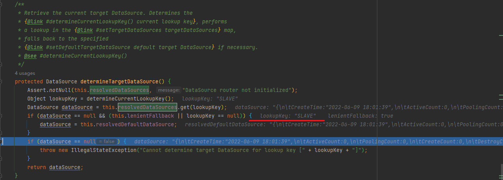

## 特别关注信息记录
AbstractRoutingDataSource 主要通过这个类实现动态数据源切换

DynamicDataSource

 ```java
 public class DynamicDataSource extends AbstractRoutingDataSource {

    public DynamicDataSource(DynamicDataSourceProvider dynamicDataSourceProvider) {
        Map<Object, Object> targetDataSources = new HashMap<>(dynamicDataSourceProvider.loadDataSources());
        // 初始默认数据源
        super.setDefaultTargetDataSource(dynamicDataSourceProvider.loadDataSources().get(DataSourceType.MASTER.name()));
        // 设置所有可用的数据源节点
        super.setTargetDataSources(targetDataSources); 
    }

    @Override
    protected Object determineCurrentLookupKey() {
        // 断点调试如下图，通过线程返回当前数据源 key 后，获取对应的 DataSource
        return DynamicDataSourceContextHolder.getDataSourceType();
    }
}
```



AbstractRoutingDataSource

```java

public abstract class AbstractRoutingDataSource extends AbstractDataSource implements InitializingBean {

    // targetDataSources 与 resolvedDataSources 之间进行转换赋值
    @Override
    public void afterPropertiesSet() {
        if (this.targetDataSources == null) {
            throw new IllegalArgumentException("Property 'targetDataSources' is required");
        }
        this.resolvedDataSources = new HashMap<>(this.targetDataSources.size());
        this.targetDataSources.forEach((key, value) -> {
            Object lookupKey = resolveSpecifiedLookupKey(key);
            DataSource dataSource = resolveSpecifiedDataSource(value);
            this.resolvedDataSources.put(lookupKey, dataSource);
        });
        if (this.defaultTargetDataSource != null) {
            this.resolvedDefaultDataSource = resolveSpecifiedDataSource(this.defaultTargetDataSource);
        }
    }

    // 获取对应的 DataSource
    protected DataSource determineTargetDataSource() {
        Assert.notNull(this.resolvedDataSources, "DataSource router not initialized");
        Object lookupKey = determineCurrentLookupKey();
        DataSource dataSource = this.resolvedDataSources.get(lookupKey);
        if (dataSource == null && (this.lenientFallback || lookupKey == null)) {
            dataSource = this.resolvedDefaultDataSource;
        }
        if (dataSource == null) {
            throw new IllegalStateException("Cannot determine target DataSource for lookup key [" + lookupKey + "]");
        }
        return dataSource;
    }
}
```

