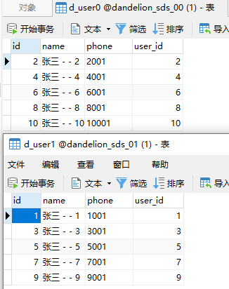
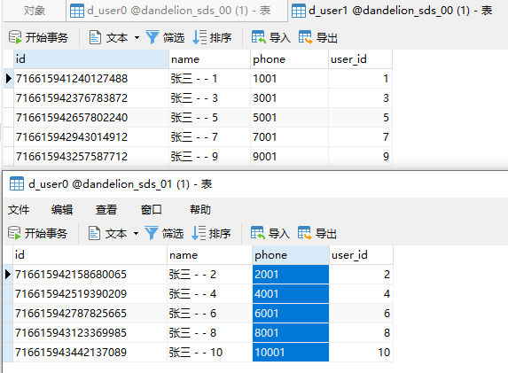

# Sharding-JDBC  4.1.0

官方文档：https://shardingsphere.apache.org/document/4.1.0/cn/overview/

## pom 配置

```
   <!-- shardingsphere 4.1.0配置 -->
   <!-- 基本配置 -->
   <dependency>
       <groupId>org.apache.shardingsphere</groupId>
       <artifactId>sharding-jdbc-spring-boot-starter</artifactId>
       <version>${shardingsphere.version}</version>
   </dependency>
   <dependency>
       <groupId>org.apache.shardingsphere</groupId>
       <artifactId>sharding-core-common</artifactId>
       <version>${shardingsphere.version}</version>
   </dependency>
   <dependency>
       <groupId>org.apache.shardingsphere</groupId>
       <artifactId>shardingsphere-common</artifactId>
       <version>${shardingsphere.version}</version>
   </dependency>
   <dependency>
       <groupId>org.apache.shardingsphere</groupId>
       <artifactId>sharding-core-api</artifactId>
       <version>${shardingsphere.version}</version>
   </dependency>
   <dependency>
       <groupId>org.apache.shardingsphere</groupId>
       <artifactId>encrypt-core-common</artifactId>
       <version>${shardingsphere.version}</version>
   </dependency>
   <dependency>
       <groupId>org.apache.shardingsphere</groupId>
       <artifactId>sharding-jdbc-core</artifactId>
       <version>${shardingsphere.version}</version>
   </dependency>
   
   <!-- 事务配置（需要时增加） -->
   <!-- XA事务模块 -->
   <!--<dependency>
       <groupId>org.apache.shardingsphere</groupId>
       <artifactId>sharding-transaction-core</artifactId>
       <version>${shardingsphere.version}</version>
   </dependency>
   <dependency>
       <groupId>org.apache.shardingsphere</groupId>
       <artifactId>sharding-transaction-xa-core</artifactId>
       <version>${shardingsphere.version}</version>
   </dependency>-->
   
   <!-- BASE事务（Seata）模块 -->
   <!--<dependency>
       <groupId>org.apache.shardingsphere</groupId>
       <artifactId>sharding-transaction-base-seata-at</artifactId>
       <version>${shardingsphere.version}</version>
   </dependency>-->
   
   <!-- 数据编排治理（需要时增加） -->
   <!--
   <dependency>
       <groupId>org.apache.shardingsphere</groupId>
       <artifactId>sharding-jdbc-orchestration-spring-boot-starter</artifactId>
       <version>${shardingsphere.version}</version>
   </dependency>-->
   
   <!-- 使用Zookeeper作为编排治理组件 -->
   <!--
   <dependency>
       <groupId>org.apache.shardingsphere</groupId>
       <artifactId>sharding-orchestration-center-zookeeper-curator</artifactId>
       <version>${shardingsphere.version}</version>
   </dependency>-->
```

## 一. 配置说明

* 内部类说明 待定
    * 策略：org.apache.shardingsphere.core.strategy.route.ShardingStrategy
    * 算法：org.apache.shardingsphere.api.sharding.ShardingAlgorithm

> 不理解的配置
> * 绑定表：【spring.shardingsphere.sharding.binding-tables】，当同一个请求查询不同数据表时，保证当前数据都在同一分片下，但是在关联A表-B表测试查询时，个人理解本身就会根据所配置的分片键以及分片规则进行查询，那么这个绑定表实际的意义在哪里；
>

## 二. 验证

### 验证一，数据分片，分库

#### 新建 application-sharding-standard.properties

```properties
# 数据源名称，多数据源以逗号分割
spring.shardingsphere.datasource.names=dandelion-sds-00,dandelion-sds-01
# 数据库连接池类名称
spring.shardingsphere.datasource.dandelion-sds-00.type=com.alibaba.druid.pool.DruidDataSource
# 驱动
spring.shardingsphere.datasource.dandelion-sds-00.driver-class-name=com.mysql.cj.jdbc.Driver
# url
spring.shardingsphere.datasource.dandelion-sds-00.url=jdbc:mysql://192.168.80.100:3306/dandelion_sds_00?useUnicode=true&characterEncoding=utf-8&useSSL=true&serverTimezone=Asia/Shanghai
# 用户
spring.shardingsphere.datasource.dandelion-sds-00.username=root
# 密码
spring.shardingsphere.datasource.dandelion-sds-00.password=root
# 同上
spring.shardingsphere.datasource.dandelion-sds-01.type=com.alibaba.druid.pool.DruidDataSource
spring.shardingsphere.datasource.dandelion-sds-01.driver-class-name=com.mysql.cj.jdbc.Driver
spring.shardingsphere.datasource.dandelion-sds-01.url=jdbc:mysql://192.168.80.100:3306/dandelion_sds_01?useUnicode=true&characterEncoding=utf-8&useSSL=true&serverTimezone=Asia/Shanghai
spring.shardingsphere.datasource.dandelion-sds-01.username=root
spring.shardingsphere.datasource.dandelion-sds-01.password=root
# 分库配置
# 分片键
spring.shardingsphere.sharding.default-database-strategy.inline.sharding-column=id
# 分片规则 ds 为数据源配置的‘逻辑名称’ 取余
spring.shardingsphere.sharding.default-database-strategy.inline.algorithm-expression=dandelion-sds-0$->{id % 2}
# d_user 分表配置 不加这一行不知道执行结果为什么会返回空值
spring.shardingsphere.sharding.tables.d_user.actual-data-nodes=dandelion-sds-0$->{0..1}.d_user
# 打印SQL
spring.shardingsphere.props.sql.show=true
```

#### 创建两个 mysql 数据库

**dandelion_sds_00**  
**dandelion_sds_01**  
对应添加如下表：

```mysql
-- ----------------------------
-- Table structure for d_user
-- ----------------------------
DROP TABLE IF EXISTS `d_user`;
CREATE TABLE `d_user`
(
    `id`    int(11)                                                       NOT NULL,
    `name`  varchar(255) CHARACTER SET utf8mb4 COLLATE utf8mb4_general_ci NULL DEFAULT NULL,
    `phone` varchar(255) CHARACTER SET utf8mb4 COLLATE utf8mb4_general_ci NULL DEFAULT NULL,
    PRIMARY KEY (`id`) USING BTREE
) ENGINE = InnoDB
  CHARACTER SET = utf8mb4
  COLLATE = utf8mb4_general_ci
  ROW_FORMAT = DYNAMIC;

SET FOREIGN_KEY_CHECKS = 1;

-- ----------------------------
-- Table structure for d_user_del
-- ----------------------------
DROP TABLE IF EXISTS `d_user_del`;
CREATE TABLE `d_user_del`
(
    `u_id`    int(11)                                                       NULL DEFAULT NULL,
    `phone`   varchar(255) CHARACTER SET utf8mb4 COLLATE utf8mb4_general_ci NULL DEFAULT NULL,
    `age`     int(11)                                                       NULL DEFAULT NULL,
    `remark`  varchar(255) CHARACTER SET utf8mb4 COLLATE utf8mb4_general_ci NULL DEFAULT NULL,
    `address` varchar(255) CHARACTER SET utf8mb4 COLLATE utf8mb4_general_ci NULL DEFAULT NULL,
    `id`      int(11)                                                       NOT NULL,
    PRIMARY KEY (`id`) USING BTREE
) ENGINE = InnoDB
  CHARACTER SET = utf8mb4
  COLLATE = utf8mb4_general_ci
  ROW_FORMAT = Dynamic;

SET FOREIGN_KEY_CHECKS = 1;
```

#### Mapper

```java
import org.apache.ibatis.annotations.Mapper;
import org.dandelion.data.sharding.entity.User;

/**
 * TODO inline
 *
 * @author L
 * @version 1.0
 * @date 2022/3/29 15:13
 */
@Mapper
public interface UserMapper {

    User get(User user);

    int saveByUser(User user);
}
```

#### UserMapper.xml

```xml
<?xml version="1.0" encoding="UTF-8" ?>
<!DOCTYPE mapper PUBLIC "-//mybatis.org//DTD Mapper 3.0//EN" "http://mybatis.org/dtd/mybatis-3-mapper.dtd">
<mapper namespace="org.dandelion.data.sharding.mapper.UserMapper">

    <select id="getByUser" resultType="org.dandelion.data.sharding.entity.User"
            parameterType="org.dandelion.data.sharding.entity.User">
        select * from d_user where id=#{id}
    </select>

    <insert id="saveByUser" parameterType="org.dandelion.data.sharding.entity.User">
        insert into d_user (id, name, phone)
        values (#{id}, #{name}, #{phone})
    </insert>
</mapper>
```

#### 测试验证

```java
import org.dandelion.data.sharding.entity.User;
import org.dandelion.data.sharding.mapper.UserMapper;
import org.junit.Test;
import org.junit.runner.RunWith;
import org.springframework.beans.factory.annotation.Autowired;
import org.springframework.boot.test.context.SpringBootTest;
import org.springframework.test.context.junit4.SpringRunner;

/**
 * TODO
 *
 * @author L
 * @version 1.0
 * @date 2022/3/29 18:01
 */
@RunWith(SpringRunner.class)
@SpringBootTest(classes = ShardingSphereJdbcApplication.class)
public class StandardTest {

    @Autowired
    private UserMapper standardMapper;

    /**
     * 查询验证
     */
    @Test
    public void test1() {
        User user1 = new User();
        user1.setId(1);

        User user = standardMapper.getByUser(user1);
        System.out.println(user);
    }

    /**
     * 新增验证
     */
    @Test
    public void test4() {
        for (int i = 1; i <= 10; i++) {
            User user = new User();
            user.setId(i);
            user.setName("张三 - - " + i);
            user.setPhone(i + "001");
            int saveByUser = standardMapper.saveByUser(user);
            System.out.println(saveByUser);
        }
    }
}
```

#### 结果

```
查询结果：

  2022-03-30 11:34:03.085INFO 13916---[main]ShardingSphere-SQL:Logic SQL:select*from d_user where id=?
  2022-03-30 11:34:03.085INFO 13916---[main]ShardingSphere-SQL:SQLStatement:SelectStatementContext(super=CommonSQLStatementContext(sqlStatement=org.apache.shardingsphere.sql.parser.sql.statement.dml.SelectStatement@36510e73,tablesContext=org.apache.shardingsphere.sql.parser.binder.segment.table.TablesContext@2c47a053),tablesContext=org.apache.shardingsphere.sql.parser.binder.segment.table.TablesContext@2c47a053,projectionsContext=ProjectionsContext(startIndex=7,stopIndex=7,distinctRow=false,projections=[ShorthandProjection(owner=Optional.empty,actualColumns=[ColumnProjection(owner=null,name=id,alias=Optional.empty),ColumnProjection(owner=null,name=name,alias=Optional.empty),ColumnProjection(owner=null,name=phone,alias=Optional.empty)])]),groupByContext=org.apache.shardingsphere.sql.parser.binder.segment.select.groupby.GroupByContext@5d2a86c0,orderByContext=org.apache.shardingsphere.sql.parser.binder.segment.select.orderby.OrderByContext@5ba1b62e,paginationContext=org.apache.shardingsphere.sql.parser.binder.segment.select.pagination.PaginationContext@65bd19bf,containsSubquery=false)
  2022-03-30 11:34:03.086INFO 13916---[main]ShardingSphere-SQL:Actual SQL:dandelion-sds-01:::select*from d_user where id=?:::[1]
  User[Hash=1872158052,id=1,name=张三,phone=123,serialVersionUID=1]
  
增加结果：

  2022-03-30 14:43:43.526  INFO 15440 --- [           main] ShardingSphere-SQL                       : Logic SQL: insert into d_user (id, name, phone) values (?, ?, ?)
  2022-03-30 14:43:43.526  INFO 15440 --- [           main] ShardingSphere-SQL                       : SQLStatement: InsertStatementContext(super=CommonSQLStatementContext(sqlStatement=org.apache.shardingsphere.sql.parser.sql.statement.dml.InsertStatement@24a4e2c5, tablesContext=org.apache.shardingsphere.sql.parser.binder.segment.table.TablesContext@27da994b), tablesContext=org.apache.shardingsphere.sql.parser.binder.segment.table.TablesContext@27da994b, columnNames=[id, name, phone], insertValueContexts=[InsertValueContext(parametersCount=3, valueExpressions=[ParameterMarkerExpressionSegment(startIndex=53, stopIndex=53, parameterMarkerIndex=0), ParameterMarkerExpressionSegment(startIndex=56, stopIndex=56, parameterMarkerIndex=1), ParameterMarkerExpressionSegment(startIndex=59, stopIndex=59, parameterMarkerIndex=2)], parameters=[1, 张三 - - 1, 1001])], generatedKeyContext=Optional.empty)
  2022-03-30 14:43:43.526  INFO 15440 --- [           main] ShardingSphere-SQL                       : Actual SQL: dandelion-sds-01 ::: insert into d_user (id, name, phone) values (?, ?, ?) ::: [1, 张三 - - 1, 1001]
  1
  2022-03-30 14:43:43.586  INFO 15440 --- [           main] ShardingSphere-SQL                       : Logic SQL: insert into d_user (id, name, phone) values (?, ?, ?)
  2022-03-30 14:43:43.586  INFO 15440 --- [           main] ShardingSphere-SQL                       : SQLStatement: InsertStatementContext(super=CommonSQLStatementContext(sqlStatement=org.apache.shardingsphere.sql.parser.sql.statement.dml.InsertStatement@24a4e2c5, tablesContext=org.apache.shardingsphere.sql.parser.binder.segment.table.TablesContext@230232b0), tablesContext=org.apache.shardingsphere.sql.parser.binder.segment.table.TablesContext@230232b0, columnNames=[id, name, phone], insertValueContexts=[InsertValueContext(parametersCount=3, valueExpressions=[ParameterMarkerExpressionSegment(startIndex=53, stopIndex=53, parameterMarkerIndex=0), ParameterMarkerExpressionSegment(startIndex=56, stopIndex=56, parameterMarkerIndex=1), ParameterMarkerExpressionSegment(startIndex=59, stopIndex=59, parameterMarkerIndex=2)], parameters=[2, 张三 - - 2, 2001])], generatedKeyContext=Optional.empty)
  2022-03-30 14:43:43.586  INFO 15440 --- [           main] ShardingSphere-SQL                       : Actual SQL: dandelion-sds-00 ::: insert into d_user (id, name, phone) values (?, ?, ?) ::: [2, 张三 - - 2, 2001]
  1
  2022-03-30 14:43:43.611  INFO 15440 --- [           main] ShardingSphere-SQL                       : Logic SQL: insert into d_user (id, name, phone) values (?, ?, ?)
  2022-03-30 14:43:43.611  INFO 15440 --- [           main] ShardingSphere-SQL                       : SQLStatement: InsertStatementContext(super=CommonSQLStatementContext(sqlStatement=org.apache.shardingsphere.sql.parser.sql.statement.dml.InsertStatement@24a4e2c5, tablesContext=org.apache.shardingsphere.sql.parser.binder.segment.table.TablesContext@5b742bc8), tablesContext=org.apache.shardingsphere.sql.parser.binder.segment.table.TablesContext@5b742bc8, columnNames=[id, name, phone], insertValueContexts=[InsertValueContext(parametersCount=3, valueExpressions=[ParameterMarkerExpressionSegment(startIndex=53, stopIndex=53, parameterMarkerIndex=0), ParameterMarkerExpressionSegment(startIndex=56, stopIndex=56, parameterMarkerIndex=1), ParameterMarkerExpressionSegment(startIndex=59, stopIndex=59, parameterMarkerIndex=2)], parameters=[3, 张三 - - 3, 3001])], generatedKeyContext=Optional.empty)
  2022-03-30 14:43:43.611  INFO 15440 --- [           main] ShardingSphere-SQL                       : Actual SQL: dandelion-sds-01 ::: insert into d_user (id, name, phone) values (?, ?, ?) ::: [3, 张三 - - 3, 3001]
  1
  2022-03-30 14:43:43.631  INFO 15440 --- [           main] ShardingSphere-SQL                       : Logic SQL: insert into d_user (id, name, phone) values (?, ?, ?)
  2022-03-30 14:43:43.631  INFO 15440 --- [           main] ShardingSphere-SQL                       : SQLStatement: InsertStatementContext(super=CommonSQLStatementContext(sqlStatement=org.apache.shardingsphere.sql.parser.sql.statement.dml.InsertStatement@24a4e2c5, tablesContext=org.apache.shardingsphere.sql.parser.binder.segment.table.TablesContext@722531ab), tablesContext=org.apache.shardingsphere.sql.parser.binder.segment.table.TablesContext@722531ab, columnNames=[id, name, phone], insertValueContexts=[InsertValueContext(parametersCount=3, valueExpressions=[ParameterMarkerExpressionSegment(startIndex=53, stopIndex=53, parameterMarkerIndex=0), ParameterMarkerExpressionSegment(startIndex=56, stopIndex=56, parameterMarkerIndex=1), ParameterMarkerExpressionSegment(startIndex=59, stopIndex=59, parameterMarkerIndex=2)], parameters=[4, 张三 - - 4, 4001])], generatedKeyContext=Optional.empty)
  2022-03-30 14:43:43.631  INFO 15440 --- [           main] ShardingSphere-SQL                       : Actual SQL: dandelion-sds-00 ::: insert into d_user (id, name, phone) values (?, ?, ?) ::: [4, 张三 - - 4, 4001]
  1
  2022-03-30 14:43:43.652  INFO 15440 --- [           main] ShardingSphere-SQL                       : Logic SQL: insert into d_user (id, name, phone) values (?, ?, ?)
  2022-03-30 14:43:43.652  INFO 15440 --- [           main] ShardingSphere-SQL                       : SQLStatement: InsertStatementContext(super=CommonSQLStatementContext(sqlStatement=org.apache.shardingsphere.sql.parser.sql.statement.dml.InsertStatement@24a4e2c5, tablesContext=org.apache.shardingsphere.sql.parser.binder.segment.table.TablesContext@66451058), tablesContext=org.apache.shardingsphere.sql.parser.binder.segment.table.TablesContext@66451058, columnNames=[id, name, phone], insertValueContexts=[InsertValueContext(parametersCount=3, valueExpressions=[ParameterMarkerExpressionSegment(startIndex=53, stopIndex=53, parameterMarkerIndex=0), ParameterMarkerExpressionSegment(startIndex=56, stopIndex=56, parameterMarkerIndex=1), ParameterMarkerExpressionSegment(startIndex=59, stopIndex=59, parameterMarkerIndex=2)], parameters=[5, 张三 - - 5, 5001])], generatedKeyContext=Optional.empty)
  2022-03-30 14:43:43.652  INFO 15440 --- [           main] ShardingSphere-SQL                       : Actual SQL: dandelion-sds-01 ::: insert into d_user (id, name, phone) values (?, ?, ?) ::: [5, 张三 - - 5, 5001]
  1
  2022-03-30 14:43:43.674  INFO 15440 --- [           main] ShardingSphere-SQL                       : Logic SQL: insert into d_user (id, name, phone) values (?, ?, ?)
  2022-03-30 14:43:43.675  INFO 15440 --- [           main] ShardingSphere-SQL                       : SQLStatement: InsertStatementContext(super=CommonSQLStatementContext(sqlStatement=org.apache.shardingsphere.sql.parser.sql.statement.dml.InsertStatement@24a4e2c5, tablesContext=org.apache.shardingsphere.sql.parser.binder.segment.table.TablesContext@6ef4cbe1), tablesContext=org.apache.shardingsphere.sql.parser.binder.segment.table.TablesContext@6ef4cbe1, columnNames=[id, name, phone], insertValueContexts=[InsertValueContext(parametersCount=3, valueExpressions=[ParameterMarkerExpressionSegment(startIndex=53, stopIndex=53, parameterMarkerIndex=0), ParameterMarkerExpressionSegment(startIndex=56, stopIndex=56, parameterMarkerIndex=1), ParameterMarkerExpressionSegment(startIndex=59, stopIndex=59, parameterMarkerIndex=2)], parameters=[6, 张三 - - 6, 6001])], generatedKeyContext=Optional.empty)
  2022-03-30 14:43:43.675  INFO 15440 --- [           main] ShardingSphere-SQL                       : Actual SQL: dandelion-sds-00 ::: insert into d_user (id, name, phone) values (?, ?, ?) ::: [6, 张三 - - 6, 6001]
  1
  2022-03-30 14:43:43.712  INFO 15440 --- [           main] ShardingSphere-SQL                       : Logic SQL: insert into d_user (id, name, phone) values (?, ?, ?)
  2022-03-30 14:43:43.712  INFO 15440 --- [           main] ShardingSphere-SQL                       : SQLStatement: InsertStatementContext(super=CommonSQLStatementContext(sqlStatement=org.apache.shardingsphere.sql.parser.sql.statement.dml.InsertStatement@24a4e2c5, tablesContext=org.apache.shardingsphere.sql.parser.binder.segment.table.TablesContext@6bce4140), tablesContext=org.apache.shardingsphere.sql.parser.binder.segment.table.TablesContext@6bce4140, columnNames=[id, name, phone], insertValueContexts=[InsertValueContext(parametersCount=3, valueExpressions=[ParameterMarkerExpressionSegment(startIndex=53, stopIndex=53, parameterMarkerIndex=0), ParameterMarkerExpressionSegment(startIndex=56, stopIndex=56, parameterMarkerIndex=1), ParameterMarkerExpressionSegment(startIndex=59, stopIndex=59, parameterMarkerIndex=2)], parameters=[7, 张三 - - 7, 7001])], generatedKeyContext=Optional.empty)
  2022-03-30 14:43:43.712  INFO 15440 --- [           main] ShardingSphere-SQL                       : Actual SQL: dandelion-sds-01 ::: insert into d_user (id, name, phone) values (?, ?, ?) ::: [7, 张三 - - 7, 7001]
  1
  2022-03-30 14:43:43.740  INFO 15440 --- [           main] ShardingSphere-SQL                       : Logic SQL: insert into d_user (id, name, phone) values (?, ?, ?)
  2022-03-30 14:43:43.740  INFO 15440 --- [           main] ShardingSphere-SQL                       : SQLStatement: InsertStatementContext(super=CommonSQLStatementContext(sqlStatement=org.apache.shardingsphere.sql.parser.sql.statement.dml.InsertStatement@24a4e2c5, tablesContext=org.apache.shardingsphere.sql.parser.binder.segment.table.TablesContext@18cf5c52), tablesContext=org.apache.shardingsphere.sql.parser.binder.segment.table.TablesContext@18cf5c52, columnNames=[id, name, phone], insertValueContexts=[InsertValueContext(parametersCount=3, valueExpressions=[ParameterMarkerExpressionSegment(startIndex=53, stopIndex=53, parameterMarkerIndex=0), ParameterMarkerExpressionSegment(startIndex=56, stopIndex=56, parameterMarkerIndex=1), ParameterMarkerExpressionSegment(startIndex=59, stopIndex=59, parameterMarkerIndex=2)], parameters=[8, 张三 - - 8, 8001])], generatedKeyContext=Optional.empty)
  2022-03-30 14:43:43.740  INFO 15440 --- [           main] ShardingSphere-SQL                       : Actual SQL: dandelion-sds-00 ::: insert into d_user (id, name, phone) values (?, ?, ?) ::: [8, 张三 - - 8, 8001]
  1
  2022-03-30 14:43:43.762  INFO 15440 --- [           main] ShardingSphere-SQL                       : Logic SQL: insert into d_user (id, name, phone) values (?, ?, ?)
  2022-03-30 14:43:43.763  INFO 15440 --- [           main] ShardingSphere-SQL                       : SQLStatement: InsertStatementContext(super=CommonSQLStatementContext(sqlStatement=org.apache.shardingsphere.sql.parser.sql.statement.dml.InsertStatement@24a4e2c5, tablesContext=org.apache.shardingsphere.sql.parser.binder.segment.table.TablesContext@20a3e10c), tablesContext=org.apache.shardingsphere.sql.parser.binder.segment.table.TablesContext@20a3e10c, columnNames=[id, name, phone], insertValueContexts=[InsertValueContext(parametersCount=3, valueExpressions=[ParameterMarkerExpressionSegment(startIndex=53, stopIndex=53, parameterMarkerIndex=0), ParameterMarkerExpressionSegment(startIndex=56, stopIndex=56, parameterMarkerIndex=1), ParameterMarkerExpressionSegment(startIndex=59, stopIndex=59, parameterMarkerIndex=2)], parameters=[9, 张三 - - 9, 9001])], generatedKeyContext=Optional.empty)
  2022-03-30 14:43:43.763  INFO 15440 --- [           main] ShardingSphere-SQL                       : Actual SQL: dandelion-sds-01 ::: insert into d_user (id, name, phone) values (?, ?, ?) ::: [9, 张三 - - 9, 9001]
  1
  2022-03-30 14:43:43.780  INFO 15440 --- [           main] ShardingSphere-SQL                       : Logic SQL: insert into d_user (id, name, phone) values (?, ?, ?)
  2022-03-30 14:43:43.780  INFO 15440 --- [           main] ShardingSphere-SQL                       : SQLStatement: InsertStatementContext(super=CommonSQLStatementContext(sqlStatement=org.apache.shardingsphere.sql.parser.sql.statement.dml.InsertStatement@24a4e2c5, tablesContext=org.apache.shardingsphere.sql.parser.binder.segment.table.TablesContext@5002fde9), tablesContext=org.apache.shardingsphere.sql.parser.binder.segment.table.TablesContext@5002fde9, columnNames=[id, name, phone], insertValueContexts=[InsertValueContext(parametersCount=3, valueExpressions=[ParameterMarkerExpressionSegment(startIndex=53, stopIndex=53, parameterMarkerIndex=0), ParameterMarkerExpressionSegment(startIndex=56, stopIndex=56, parameterMarkerIndex=1), ParameterMarkerExpressionSegment(startIndex=59, stopIndex=59, parameterMarkerIndex=2)], parameters=[10, 张三 - - 10, 10001])], generatedKeyContext=Optional.empty)
  2022-03-30 14:43:43.780  INFO 15440 --- [           main] ShardingSphere-SQL                       : Actual SQL: dandelion-sds-00 ::: insert into d_user (id, name, phone) values (?, ?, ?) ::: [10, 张三 - - 10, 10001]
  1
```

#### 在查询没有使用 【分片键】 时

```xml

<select id="getByName" resultType="org.dandelion.data.sharding.entity.User" parameterType="string">
    select * from d_user where name=#{name}
</select>
```

```java

import org.apache.ibatis.annotations.Mapper;
import org.dandelion.data.sharding.entity.User;

/**
 * TODO inline
 *
 * @author L
 * @version 1.0
 * @date 2022/3/29 15:13
 */
@Mapper
public interface UserMapper {

    User getByName(String name);
}
```

```java
import org.dandelion.data.sharding.entity.User;
import org.dandelion.data.sharding.mapper.UserMapper;
import org.junit.Test;
import org.junit.runner.RunWith;
import org.springframework.beans.factory.annotation.Autowired;
import org.springframework.boot.test.context.SpringBootTest;
import org.springframework.test.context.junit4.SpringRunner;

/**
 * TODO
 *
 * @author L
 * @version 1.0
 * @date 2022/3/29 18:01
 */
@RunWith(SpringRunner.class)
@SpringBootTest(classes = ShardingSphereJdbcApplication.class)
public class StandardTest {

    @Autowired
    private UserMapper standardMapper;

    @Test
    public void test3() {
        User user = standardMapper.getByName("张三");
        System.out.println(user);
    }
}
```

**会同时查询所有数据源进行匹配查询，会全库表路由**

```
运行结果

  2022-03-30 14:10:55.473  INFO 14792 --- [           main] ShardingSphere-SQL                       : Logic SQL: select * from d_user where name=?
  2022-03-30 14:10:55.474  INFO 14792 --- [           main] ShardingSphere-SQL                       : SQLStatement: SelectStatementContext(super=CommonSQLStatementContext(sqlStatement=org.apache.shardingsphere.sql.parser.sql.statement.dml.SelectStatement@7ea71fc2, tablesContext=org.apache.shardingsphere.sql.parser.binder.segment.table.TablesContext@19ad75e5), tablesContext=org.apache.shardingsphere.sql.parser.binder.segment.table.TablesContext@19ad75e5, projectionsContext=ProjectionsContext(startIndex=7, stopIndex=7, distinctRow=false, projections=[ShorthandProjection(owner=Optional.empty, actualColumns=[ColumnProjection(owner=null, name=id, alias=Optional.empty), ColumnProjection(owner=null, name=name, alias=Optional.empty), ColumnProjection(owner=null, name=phone, alias=Optional.empty)])]), groupByContext=org.apache.shardingsphere.sql.parser.binder.segment.select.groupby.GroupByContext@7cd5fcf4, orderByContext=org.apache.shardingsphere.sql.parser.binder.segment.select.orderby.OrderByContext@19cdc217, paginationContext=org.apache.shardingsphere.sql.parser.binder.segment.select.pagination.PaginationContext@5f5297e3, containsSubquery=false)
  2022-03-30 14:10:55.475  INFO 14792 --- [           main] ShardingSphere-SQL                       : Actual SQL: dandelion-sds-00 ::: select * from d_user where name=? ::: [张三]
  2022-03-30 14:10:55.475  INFO 14792 --- [           main] ShardingSphere-SQL                       : Actual SQL: dandelion-sds-01 ::: select * from d_user where name=? ::: [张三]
  User [Hash = 235740612, id=3, name=张三, phone=222, serialVersionUID=1]
```

### 验证二，数据分片，分库分表

#### 在 application-sharding-standard.properties 基础上增加

```properties
# d_user 分表配置
spring.shardingsphere.sharding.tables.d_user.actual-data-nodes=dandelion-sds-0$->{0..1}.d_user$->{0..1}
# 分片键设置
spring.shardingsphere.sharding.tables.d_user.table-strategy.inline.sharding-column=user_id
# 分片规则
spring.shardingsphere.sharding.tables.d_user.table-strategy.inline.algorithm-expression=d_user$->{user_id % 2}
# d_user_del 分表配置
spring.shardingsphere.sharding.tables.d_user_del.actual-data-nodes=dandelion-sds-0$->{0..1}.d_user_del$->{0..1}
# 分片键设置
spring.shardingsphere.sharding.tables.d_user_del.table-strategy.inline.sharding-column=user_id
# 分片规则
spring.shardingsphere.sharding.tables.d_user_del.table-strategy.inline.algorithm-expression=d_user_del$->{user_id % 2}
```

#### 在两个库中对应新建【d_user0、d_user1】两张表，新建共计四张表

```mysql
-- ----------------------------
-- Table structure for d_user0
-- ----------------------------
DROP TABLE IF EXISTS `d_user0`;
CREATE TABLE `d_user0`
(
    `id`      int(11)                                                       NOT NULL,
    `name`    varchar(255) CHARACTER SET utf8mb4 COLLATE utf8mb4_general_ci NULL DEFAULT NULL,
    `phone`   varchar(255) CHARACTER SET utf8mb4 COLLATE utf8mb4_general_ci NULL DEFAULT NULL,
    `user_id` int(11)                                                       NULL DEFAULT NULL,
    PRIMARY KEY (`id`) USING BTREE
) ENGINE = InnoDB
  CHARACTER SET = utf8mb4
  COLLATE = utf8mb4_general_ci
  ROW_FORMAT = DYNAMIC;

SET FOREIGN_KEY_CHECKS = 1;

-- ----------------------------
-- Table structure for d_user1
-- ----------------------------
DROP TABLE IF EXISTS `d_user1`;
CREATE TABLE `d_user1`
(
    `id`      int(11)                                                       NOT NULL,
    `name`    varchar(255) CHARACTER SET utf8mb4 COLLATE utf8mb4_general_ci NULL DEFAULT NULL,
    `phone`   varchar(255) CHARACTER SET utf8mb4 COLLATE utf8mb4_general_ci NULL DEFAULT NULL,
    `user_id` int(11)                                                       NULL DEFAULT NULL,
    PRIMARY KEY (`id`) USING BTREE
) ENGINE = InnoDB
  CHARACTER SET = utf8mb4
  COLLATE = utf8mb4_general_ci
  ROW_FORMAT = DYNAMIC;

SET FOREIGN_KEY_CHECKS = 1;
```

#### UserMapper.xml

```xml
<?xml version="1.0" encoding="UTF-8" ?>
<!DOCTYPE mapper PUBLIC "-//mybatis.org//DTD Mapper 3.0//EN" "http://mybatis.org/dtd/mybatis-3-mapper.dtd">
<mapper namespace="org.dandelion.data.sharding.mapper.UserMapper">

    <select id="getByUser" resultType="org.dandelion.data.sharding.entity.User"
            parameterType="org.dandelion.data.sharding.entity.User">
        select *
        from d_user
        where id = #{id} and user_id=#{userId}
    </select>

    <insert id="saveByUser" parameterType="org.dandelion.data.sharding.entity.User">
        insert into d_user (id, name, phone,user_id)
        values (#{id}, #{name}, #{phone},#{userId})
    </insert>
</mapper>
```

#### 测试验证

```java
import com.alibaba.fastjson.JSONObject;
import org.dandelion.data.sharding.entity.User;
import org.dandelion.data.sharding.entity.UserDel;
import org.dandelion.data.sharding.mapper.UserDelMapper;
import org.dandelion.data.sharding.mapper.UserMapper;
import org.junit.Test;
import org.junit.runner.RunWith;
import org.springframework.beans.factory.annotation.Autowired;
import org.springframework.boot.test.context.SpringBootTest;
import org.springframework.test.context.junit4.SpringRunner;

import java.util.List;
import java.util.Map;

/**
 * TODO
 *
 * @author L
 * @version 1.0
 * @date 2022/3/29 18:01
 */
@RunWith(SpringRunner.class)
@SpringBootTest(classes = ShardingSphereJdbcApplication.class)
public class StandardTest {

    @Autowired
    private UserMapper userMapper;

    @Autowired
    private UserDelMapper userDelMapper;

    @Test
    public void test1() {
        User user1 = new User();
        user1.setId(2);
        user1.setUserId(1);

        User user = userMapper.getByUser(user1);
        System.out.println(user);
    }

    @Test
    public void test4() {
        for (int i = 1; i <= 10; i++) {
            User user = new User();
            user.setId(i);
            user.setName("张三 - - " + i);
            user.setPhone(i + "001");
            user.setUserId(i);
            int saveByUser = userMapper.saveByUser(user);
            System.out.println(saveByUser);
        }
    }
}
```

#### 结果

```
增加结果

  2022-04-01 11:11:18.248  INFO 6952 --- [           main] ShardingSphere-SQL                       : Logic SQL: insert into d_user (id, name, phone,user_id) values (?, ?, ?,?)
  2022-04-01 11:11:18.249  INFO 6952 --- [           main] ShardingSphere-SQL                       : SQLStatement: InsertStatementContext(super=CommonSQLStatementContext(sqlStatement=org.apache.shardingsphere.sql.parser.sql.statement.dml.InsertStatement@4c24f3a2, tablesContext=org.apache.shardingsphere.sql.parser.binder.segment.table.TablesContext@783b3aa0), tablesContext=org.apache.shardingsphere.sql.parser.binder.segment.table.TablesContext@783b3aa0, columnNames=[id, name, phone, user_id], insertValueContexts=[InsertValueContext(parametersCount=4, valueExpressions=[ParameterMarkerExpressionSegment(startIndex=61, stopIndex=61, parameterMarkerIndex=0), ParameterMarkerExpressionSegment(startIndex=64, stopIndex=64, parameterMarkerIndex=1), ParameterMarkerExpressionSegment(startIndex=67, stopIndex=67, parameterMarkerIndex=2), ParameterMarkerExpressionSegment(startIndex=69, stopIndex=69, parameterMarkerIndex=3)], parameters=[1, 张三 - - 1, 1001, 1])], generatedKeyContext=Optional.empty)
  2022-04-01 11:11:18.249  INFO 6952 --- [           main] ShardingSphere-SQL                       : Actual SQL: dandelion-sds-01 ::: insert into d_user1 (id, name, phone,user_id) values (?, ?, ?, ?) ::: [1, 张三 - - 1, 1001, 1]
  1
  2022-04-01 11:11:18.339  INFO 6952 --- [           main] ShardingSphere-SQL                       : Logic SQL: insert into d_user (id, name, phone,user_id) values (?, ?, ?,?)
  2022-04-01 11:11:18.339  INFO 6952 --- [           main] ShardingSphere-SQL                       : SQLStatement: InsertStatementContext(super=CommonSQLStatementContext(sqlStatement=org.apache.shardingsphere.sql.parser.sql.statement.dml.InsertStatement@4c24f3a2, tablesContext=org.apache.shardingsphere.sql.parser.binder.segment.table.TablesContext@1a2773a8), tablesContext=org.apache.shardingsphere.sql.parser.binder.segment.table.TablesContext@1a2773a8, columnNames=[id, name, phone, user_id], insertValueContexts=[InsertValueContext(parametersCount=4, valueExpressions=[ParameterMarkerExpressionSegment(startIndex=61, stopIndex=61, parameterMarkerIndex=0), ParameterMarkerExpressionSegment(startIndex=64, stopIndex=64, parameterMarkerIndex=1), ParameterMarkerExpressionSegment(startIndex=67, stopIndex=67, parameterMarkerIndex=2), ParameterMarkerExpressionSegment(startIndex=69, stopIndex=69, parameterMarkerIndex=3)], parameters=[2, 张三 - - 2, 2001, 2])], generatedKeyContext=Optional.empty)
  2022-04-01 11:11:18.340  INFO 6952 --- [           main] ShardingSphere-SQL                       : Actual SQL: dandelion-sds-00 ::: insert into d_user0 (id, name, phone,user_id) values (?, ?, ?, ?) ::: [2, 张三 - - 2, 2001, 2]
  1
  2022-04-01 11:11:18.400  INFO 6952 --- [           main] ShardingSphere-SQL                       : Logic SQL: insert into d_user (id, name, phone,user_id) values (?, ?, ?,?)
  2022-04-01 11:11:18.400  INFO 6952 --- [           main] ShardingSphere-SQL                       : SQLStatement: InsertStatementContext(super=CommonSQLStatementContext(sqlStatement=org.apache.shardingsphere.sql.parser.sql.statement.dml.InsertStatement@4c24f3a2, tablesContext=org.apache.shardingsphere.sql.parser.binder.segment.table.TablesContext@25699aa7), tablesContext=org.apache.shardingsphere.sql.parser.binder.segment.table.TablesContext@25699aa7, columnNames=[id, name, phone, user_id], insertValueContexts=[InsertValueContext(parametersCount=4, valueExpressions=[ParameterMarkerExpressionSegment(startIndex=61, stopIndex=61, parameterMarkerIndex=0), ParameterMarkerExpressionSegment(startIndex=64, stopIndex=64, parameterMarkerIndex=1), ParameterMarkerExpressionSegment(startIndex=67, stopIndex=67, parameterMarkerIndex=2), ParameterMarkerExpressionSegment(startIndex=69, stopIndex=69, parameterMarkerIndex=3)], parameters=[3, 张三 - - 3, 3001, 3])], generatedKeyContext=Optional.empty)
  2022-04-01 11:11:18.400  INFO 6952 --- [           main] ShardingSphere-SQL                       : Actual SQL: dandelion-sds-01 ::: insert into d_user1 (id, name, phone,user_id) values (?, ?, ?, ?) ::: [3, 张三 - - 3, 3001, 3]
  1
  2022-04-01 11:11:18.444  INFO 6952 --- [           main] ShardingSphere-SQL                       : Logic SQL: insert into d_user (id, name, phone,user_id) values (?, ?, ?,?)
  2022-04-01 11:11:18.444  INFO 6952 --- [           main] ShardingSphere-SQL                       : SQLStatement: InsertStatementContext(super=CommonSQLStatementContext(sqlStatement=org.apache.shardingsphere.sql.parser.sql.statement.dml.InsertStatement@4c24f3a2, tablesContext=org.apache.shardingsphere.sql.parser.binder.segment.table.TablesContext@1cde374), tablesContext=org.apache.shardingsphere.sql.parser.binder.segment.table.TablesContext@1cde374, columnNames=[id, name, phone, user_id], insertValueContexts=[InsertValueContext(parametersCount=4, valueExpressions=[ParameterMarkerExpressionSegment(startIndex=61, stopIndex=61, parameterMarkerIndex=0), ParameterMarkerExpressionSegment(startIndex=64, stopIndex=64, parameterMarkerIndex=1), ParameterMarkerExpressionSegment(startIndex=67, stopIndex=67, parameterMarkerIndex=2), ParameterMarkerExpressionSegment(startIndex=69, stopIndex=69, parameterMarkerIndex=3)], parameters=[4, 张三 - - 4, 4001, 4])], generatedKeyContext=Optional.empty)
  2022-04-01 11:11:18.444  INFO 6952 --- [           main] ShardingSphere-SQL                       : Actual SQL: dandelion-sds-00 ::: insert into d_user0 (id, name, phone,user_id) values (?, ?, ?, ?) ::: [4, 张三 - - 4, 4001, 4]
  1
  2022-04-01 11:11:18.485  INFO 6952 --- [           main] ShardingSphere-SQL                       : Logic SQL: insert into d_user (id, name, phone,user_id) values (?, ?, ?,?)
  2022-04-01 11:11:18.485  INFO 6952 --- [           main] ShardingSphere-SQL                       : SQLStatement: InsertStatementContext(super=CommonSQLStatementContext(sqlStatement=org.apache.shardingsphere.sql.parser.sql.statement.dml.InsertStatement@4c24f3a2, tablesContext=org.apache.shardingsphere.sql.parser.binder.segment.table.TablesContext@4662752a), tablesContext=org.apache.shardingsphere.sql.parser.binder.segment.table.TablesContext@4662752a, columnNames=[id, name, phone, user_id], insertValueContexts=[InsertValueContext(parametersCount=4, valueExpressions=[ParameterMarkerExpressionSegment(startIndex=61, stopIndex=61, parameterMarkerIndex=0), ParameterMarkerExpressionSegment(startIndex=64, stopIndex=64, parameterMarkerIndex=1), ParameterMarkerExpressionSegment(startIndex=67, stopIndex=67, parameterMarkerIndex=2), ParameterMarkerExpressionSegment(startIndex=69, stopIndex=69, parameterMarkerIndex=3)], parameters=[5, 张三 - - 5, 5001, 5])], generatedKeyContext=Optional.empty)
  2022-04-01 11:11:18.486  INFO 6952 --- [           main] ShardingSphere-SQL                       : Actual SQL: dandelion-sds-01 ::: insert into d_user1 (id, name, phone,user_id) values (?, ?, ?, ?) ::: [5, 张三 - - 5, 5001, 5]
  1
  2022-04-01 11:11:18.529  INFO 6952 --- [           main] ShardingSphere-SQL                       : Logic SQL: insert into d_user (id, name, phone,user_id) values (?, ?, ?,?)
  2022-04-01 11:11:18.529  INFO 6952 --- [           main] ShardingSphere-SQL                       : SQLStatement: InsertStatementContext(super=CommonSQLStatementContext(sqlStatement=org.apache.shardingsphere.sql.parser.sql.statement.dml.InsertStatement@4c24f3a2, tablesContext=org.apache.shardingsphere.sql.parser.binder.segment.table.TablesContext@2e4eda17), tablesContext=org.apache.shardingsphere.sql.parser.binder.segment.table.TablesContext@2e4eda17, columnNames=[id, name, phone, user_id], insertValueContexts=[InsertValueContext(parametersCount=4, valueExpressions=[ParameterMarkerExpressionSegment(startIndex=61, stopIndex=61, parameterMarkerIndex=0), ParameterMarkerExpressionSegment(startIndex=64, stopIndex=64, parameterMarkerIndex=1), ParameterMarkerExpressionSegment(startIndex=67, stopIndex=67, parameterMarkerIndex=2), ParameterMarkerExpressionSegment(startIndex=69, stopIndex=69, parameterMarkerIndex=3)], parameters=[6, 张三 - - 6, 6001, 6])], generatedKeyContext=Optional.empty)
  2022-04-01 11:11:18.529  INFO 6952 --- [           main] ShardingSphere-SQL                       : Actual SQL: dandelion-sds-00 ::: insert into d_user0 (id, name, phone,user_id) values (?, ?, ?, ?) ::: [6, 张三 - - 6, 6001, 6]
  1
  2022-04-01 11:11:18.566  INFO 6952 --- [           main] ShardingSphere-SQL                       : Logic SQL: insert into d_user (id, name, phone,user_id) values (?, ?, ?,?)
  2022-04-01 11:11:18.567  INFO 6952 --- [           main] ShardingSphere-SQL                       : SQLStatement: InsertStatementContext(super=CommonSQLStatementContext(sqlStatement=org.apache.shardingsphere.sql.parser.sql.statement.dml.InsertStatement@4c24f3a2, tablesContext=org.apache.shardingsphere.sql.parser.binder.segment.table.TablesContext@21d9cd04), tablesContext=org.apache.shardingsphere.sql.parser.binder.segment.table.TablesContext@21d9cd04, columnNames=[id, name, phone, user_id], insertValueContexts=[InsertValueContext(parametersCount=4, valueExpressions=[ParameterMarkerExpressionSegment(startIndex=61, stopIndex=61, parameterMarkerIndex=0), ParameterMarkerExpressionSegment(startIndex=64, stopIndex=64, parameterMarkerIndex=1), ParameterMarkerExpressionSegment(startIndex=67, stopIndex=67, parameterMarkerIndex=2), ParameterMarkerExpressionSegment(startIndex=69, stopIndex=69, parameterMarkerIndex=3)], parameters=[7, 张三 - - 7, 7001, 7])], generatedKeyContext=Optional.empty)
  2022-04-01 11:11:18.567  INFO 6952 --- [           main] ShardingSphere-SQL                       : Actual SQL: dandelion-sds-01 ::: insert into d_user1 (id, name, phone,user_id) values (?, ?, ?, ?) ::: [7, 张三 - - 7, 7001, 7]
  1
  2022-04-01 11:11:18.602  INFO 6952 --- [           main] ShardingSphere-SQL                       : Logic SQL: insert into d_user (id, name, phone,user_id) values (?, ?, ?,?)
  2022-04-01 11:11:18.602  INFO 6952 --- [           main] ShardingSphere-SQL                       : SQLStatement: InsertStatementContext(super=CommonSQLStatementContext(sqlStatement=org.apache.shardingsphere.sql.parser.sql.statement.dml.InsertStatement@4c24f3a2, tablesContext=org.apache.shardingsphere.sql.parser.binder.segment.table.TablesContext@642c6461), tablesContext=org.apache.shardingsphere.sql.parser.binder.segment.table.TablesContext@642c6461, columnNames=[id, name, phone, user_id], insertValueContexts=[InsertValueContext(parametersCount=4, valueExpressions=[ParameterMarkerExpressionSegment(startIndex=61, stopIndex=61, parameterMarkerIndex=0), ParameterMarkerExpressionSegment(startIndex=64, stopIndex=64, parameterMarkerIndex=1), ParameterMarkerExpressionSegment(startIndex=67, stopIndex=67, parameterMarkerIndex=2), ParameterMarkerExpressionSegment(startIndex=69, stopIndex=69, parameterMarkerIndex=3)], parameters=[8, 张三 - - 8, 8001, 8])], generatedKeyContext=Optional.empty)
  2022-04-01 11:11:18.602  INFO 6952 --- [           main] ShardingSphere-SQL                       : Actual SQL: dandelion-sds-00 ::: insert into d_user0 (id, name, phone,user_id) values (?, ?, ?, ?) ::: [8, 张三 - - 8, 8001, 8]
  1
  2022-04-01 11:11:18.656  INFO 6952 --- [           main] ShardingSphere-SQL                       : Logic SQL: insert into d_user (id, name, phone,user_id) values (?, ?, ?,?)
  2022-04-01 11:11:18.656  INFO 6952 --- [           main] ShardingSphere-SQL                       : SQLStatement: InsertStatementContext(super=CommonSQLStatementContext(sqlStatement=org.apache.shardingsphere.sql.parser.sql.statement.dml.InsertStatement@4c24f3a2, tablesContext=org.apache.shardingsphere.sql.parser.binder.segment.table.TablesContext@17216605), tablesContext=org.apache.shardingsphere.sql.parser.binder.segment.table.TablesContext@17216605, columnNames=[id, name, phone, user_id], insertValueContexts=[InsertValueContext(parametersCount=4, valueExpressions=[ParameterMarkerExpressionSegment(startIndex=61, stopIndex=61, parameterMarkerIndex=0), ParameterMarkerExpressionSegment(startIndex=64, stopIndex=64, parameterMarkerIndex=1), ParameterMarkerExpressionSegment(startIndex=67, stopIndex=67, parameterMarkerIndex=2), ParameterMarkerExpressionSegment(startIndex=69, stopIndex=69, parameterMarkerIndex=3)], parameters=[9, 张三 - - 9, 9001, 9])], generatedKeyContext=Optional.empty)
  2022-04-01 11:11:18.656  INFO 6952 --- [           main] ShardingSphere-SQL                       : Actual SQL: dandelion-sds-01 ::: insert into d_user1 (id, name, phone,user_id) values (?, ?, ?, ?) ::: [9, 张三 - - 9, 9001, 9]
  1
  2022-04-01 11:11:18.705  INFO 6952 --- [           main] ShardingSphere-SQL                       : Logic SQL: insert into d_user (id, name, phone,user_id) values (?, ?, ?,?)
  2022-04-01 11:11:18.705  INFO 6952 --- [           main] ShardingSphere-SQL                       : SQLStatement: InsertStatementContext(super=CommonSQLStatementContext(sqlStatement=org.apache.shardingsphere.sql.parser.sql.statement.dml.InsertStatement@4c24f3a2, tablesContext=org.apache.shardingsphere.sql.parser.binder.segment.table.TablesContext@55c1ced9), tablesContext=org.apache.shardingsphere.sql.parser.binder.segment.table.TablesContext@55c1ced9, columnNames=[id, name, phone, user_id], insertValueContexts=[InsertValueContext(parametersCount=4, valueExpressions=[ParameterMarkerExpressionSegment(startIndex=61, stopIndex=61, parameterMarkerIndex=0), ParameterMarkerExpressionSegment(startIndex=64, stopIndex=64, parameterMarkerIndex=1), ParameterMarkerExpressionSegment(startIndex=67, stopIndex=67, parameterMarkerIndex=2), ParameterMarkerExpressionSegment(startIndex=69, stopIndex=69, parameterMarkerIndex=3)], parameters=[10, 张三 - - 10, 10001, 10])], generatedKeyContext=Optional.empty)
  2022-04-01 11:11:18.705  INFO 6952 --- [           main] ShardingSphere-SQL                       : Actual SQL: dandelion-sds-00 ::: insert into d_user0 (id, name, phone,user_id) values (?, ?, ?, ?) ::: [10, 张三 - - 10, 10001, 10]
  1

查询结果：

  2022-04-01 11:16:35.710  INFO 1344 --- [           main] ShardingSphere-SQL                       : Logic SQL: select * from d_user where id = ? and user_id=?
  2022-04-01 11:16:35.710  INFO 1344 --- [           main] ShardingSphere-SQL                       : SQLStatement: SelectStatementContext(super=CommonSQLStatementContext(sqlStatement=org.apache.shardingsphere.sql.parser.sql.statement.dml.SelectStatement@48567727, tablesContext=org.apache.shardingsphere.sql.parser.binder.segment.table.TablesContext@10e9a5fe), tablesContext=org.apache.shardingsphere.sql.parser.binder.segment.table.TablesContext@10e9a5fe, projectionsContext=ProjectionsContext(startIndex=7, stopIndex=7, distinctRow=false, projections=[ShorthandProjection(owner=Optional.empty, actualColumns=[ColumnProjection(owner=null, name=id, alias=Optional.empty), ColumnProjection(owner=null, name=name, alias=Optional.empty), ColumnProjection(owner=null, name=phone, alias=Optional.empty), ColumnProjection(owner=null, name=user_id, alias=Optional.empty)])]), groupByContext=org.apache.shardingsphere.sql.parser.binder.segment.select.groupby.GroupByContext@259287ac, orderByContext=org.apache.shardingsphere.sql.parser.binder.segment.select.orderby.OrderByContext@1abcd059, paginationContext=org.apache.shardingsphere.sql.parser.binder.segment.select.pagination.PaginationContext@61a87366, containsSubquery=false)
  2022-04-01 11:16:35.710  INFO 1344 --- [           main] ShardingSphere-SQL                       : Actual SQL: dandelion-sds-00 ::: select * from d_user1 where id = ? and user_id=? ::: [2, 1]
  null
  
```



### 验证三，数据分片，主键使用雪花算法

#### 在 application-sharding-standard.properties 基础上增加

```properties
# 设置主键
spring.shardingsphere.sharding.tables.d_user.key-generator.column=id
# 生成规则 可使用用户自定义的列值生成器或选择内置类型：SNOWFLAKE/UUID
spring.shardingsphere.sharding.tables.d_user.key-generator.type=SNOWFLAKE
```

#### 修改 UserMapper.xml

```xml
<?xml version="1.0" encoding="UTF-8" ?>
<!DOCTYPE mapper PUBLIC "-//mybatis.org//DTD Mapper 3.0//EN" "http://mybatis.org/dtd/mybatis-3-mapper.dtd">
<mapper namespace="org.dandelion.data.sharding.mapper.UserMapper">

    <insert id="saveByUser" parameterType="org.dandelion.data.sharding.entity.User">
        insert into d_user (name, phone,user_id)
        values (#{name}, #{phone},#{userId})
    </insert>
</mapper>
```

#### 测试验证

```java
import com.alibaba.fastjson.JSONObject;
import org.dandelion.data.sharding.entity.User;
import org.dandelion.data.sharding.entity.UserDel;
import org.dandelion.data.sharding.mapper.UserDelMapper;
import org.dandelion.data.sharding.mapper.UserMapper;
import org.junit.Test;
import org.junit.runner.RunWith;
import org.springframework.beans.factory.annotation.Autowired;
import org.springframework.boot.test.context.SpringBootTest;
import org.springframework.test.context.junit4.SpringRunner;

import java.util.List;
import java.util.Map;

/**
 * TODO
 *
 * @author L
 * @version 1.0
 * @date 2022/3/29 18:01
 */
@RunWith(SpringRunner.class)
@SpringBootTest(classes = ShardingSphereJdbcApplication.class)
public class StandardTest {

    @Autowired
    private UserMapper userMapper;

    @Autowired
    private UserDelMapper userDelMapper;

    @Test
    public void test4() {
        for (int i = 1; i <= 10; i++) {
            User user = new User();
            user.setId(i);
            user.setName("张三 - - " + i);
            user.setPhone(i + "001");
            user.setUserId(i);
            int saveByUser = userMapper.saveByUser(user);
            System.out.println(saveByUser);
        }
    }
}
```

#### 结果

```
  2022-04-01 11:35:54.598  INFO 14228 --- [           main] ShardingSphere-SQL                       : Logic SQL: insert into d_user ( name, phone,user_id) values ( ?, ?,?)
  2022-04-01 11:35:54.598  INFO 14228 --- [           main] ShardingSphere-SQL                       : SQLStatement: InsertStatementContext(super=CommonSQLStatementContext(sqlStatement=org.apache.shardingsphere.sql.parser.sql.statement.dml.InsertStatement@2450256f, tablesContext=org.apache.shardingsphere.sql.parser.binder.segment.table.TablesContext@59918c8f), tablesContext=org.apache.shardingsphere.sql.parser.binder.segment.table.TablesContext@59918c8f, columnNames=[name, phone, user_id], insertValueContexts=[InsertValueContext(parametersCount=3, valueExpressions=[ParameterMarkerExpressionSegment(startIndex=59, stopIndex=59, parameterMarkerIndex=0), ParameterMarkerExpressionSegment(startIndex=62, stopIndex=62, parameterMarkerIndex=1), ParameterMarkerExpressionSegment(startIndex=64, stopIndex=64, parameterMarkerIndex=2), DerivedParameterMarkerExpressionSegment(super=ParameterMarkerExpressionSegment(startIndex=0, stopIndex=0, parameterMarkerIndex=3))], parameters=[张三 - - 1, 1001, 1])], generatedKeyContext=Optional[GeneratedKeyContext(columnName=id, generated=true, generatedValues=[716615941240127488])])
  2022-04-01 11:35:54.599  INFO 14228 --- [           main] ShardingSphere-SQL                       : Actual SQL: dandelion-sds-00 ::: insert into d_user1 ( name, phone,user_id, id) values (?, ?, ?, ?) ::: [张三 - - 1, 1001, 1, 716615941240127488]
  1
```



### 验证四
