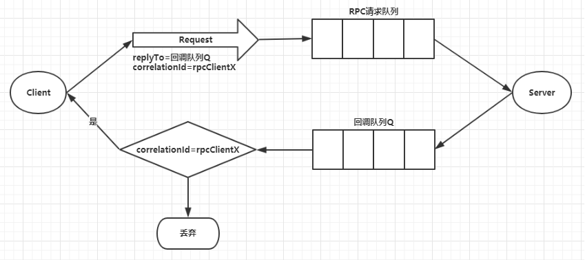

# dandelion-scheduling-rabbitmq -- rabbitmq 使用用例

## rpc 远程调用

客户端发送请求消息，服务端回复响应的消息。为了接收响应的消息，我们需要在请求消息中发送一个回调队列，可以使用默认的队列。 replyTo:通常用来设置一个回调队列，用于客户端获取响应信息。 correlationId:用来关联请求(
request)和其调用RPC之后的回复(response)，保证请求与响应是对应的。

用例视图



## 交换机类型
```
Direct Exchange：直连交换机，根据Routing Key(路由键)进行投递到不同队列。  
Fanout Exchange：扇形交换机，采用广播模式，根据绑定的交换机，路由到与之对应的所有队列。  
Topic Exchange：主题交换机，对路由键进行模式匹配后进行投递，符号#表示一个或多个词，*表示一个词。  
Header Exchange：头交换机，不处理路由键。而是根据发送的消息内容中的headers属性进行匹配。  
```

### 参考
[参考一 Spring Cloud Stream 接入](https://cloud.tencent.com/document/product/1495/64676)